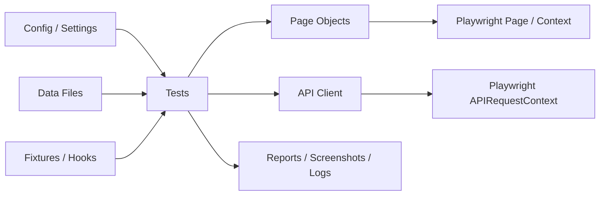

# Playwright Framework Documentation

This document explains how the Playwright-based hybrid test automation framework in this repository is structured, how it works, and how its design maps to common interview topics such as Playwright fundamentals, pytest fixtures, API testing, reporting, CI/CD, and maintainable test architecture.

> The sections below are written in a practical STAR-style format so they can be used directly in interviews: Situation, Task, Action, and Result.

---

## 1. Project Purpose

**STAR-style summary**
Situation: Modern web applications require fast, reliable, and maintainable automation coverage across UI and API layers. Task: I needed a framework that could support both browser workflow validation and backend contract checks in a single structure. Action: I built a hybrid automation framework using Python, Playwright, Pytest, Pydantic, and reporting tools. Result: The repository now demonstrates a scalable and interview-ready approach to enterprise test automation.

This repository is a hybrid UI + API automation framework built with:

- Python
- Playwright
- Pytest
- Pydantic
- Allure / HTML reporting
- GitHub Actions for CI/CD

It demonstrates how a modern automation framework can support:

- end-to-end browser testing
- API validation
- reusable page objects
- externalized configuration
- rich reporting
- parallel execution

---

## 2. High-Level Architecture



### Core Layers

**STAR-style explanation**
Situation: As the suite grew, the code needed a clearer structure to avoid test logic being mixed with plumbing. Task: I needed a layered design that separated concerns cleanly. Action: I divided the framework into tests, page objects, API wrappers, and infrastructure modules. Result: The project became easier to maintain and easier to explain in interviews.

1. Tests layer
   - Located in the tests folder.
   - Contains UI, API, and E2E test cases.

2. Page Object layer
   - Located in the pages folder.
   - Encapsulates selectors and reusable UI interactions.

3. API layer
   - Located in the api folder.
   - Encapsulates API requests and validation through typed models.

4. Infrastructure layer
   - Located in config, utils, and data.
   - Provides settings, logging, and test data.

---

## 3. Repository Mapping to Framework Concepts

### UI Test Flow

**STAR-style explanation**
Situation: UI workflows needed to be executed in a readable and maintainable way. Task: I needed a pattern that separated steps from test logic. Action: I used page objects and a shared base page to wrap Playwright interactions. Result: The tests became simpler and the UI selectors were easier to manage.

The UI flow in this repo is built around Playwright page objects:

1. A test requests a page object fixture from conftest.
2. The page object wraps Playwright selectors and actions.
3. The base page provides shared methods like click, fill, wait, and navigate.
4. The test validates the expected UI state using assertions.

Example flow:

- tests/ui/test_login.py uses the Page Object pattern.
- pages/login_page.py defines login-related locators and actions.
- pages/base_page.py centralizes resilient Playwright interactions.

### API Test Flow

**STAR-style explanation**
Situation: Backend validation was needed to complement UI checks and reduce the reliance on browser-only testing. Task: I needed a fast and structured way to test API behavior. Action: I used Playwright’s request context and a typed API client wrapper. Result: The framework could validate business rules and contracts efficiently.

The API flow is handled through Playwright's request context:

1. The fixture provides an APIRequestContext.
2. The test uses a PetstoreClient wrapper.
3. The wrapper sends requests and validates responses using Pydantic models.
4. Assertions confirm expected API behavior.

Example flow:

- tests/conftest.py creates the API request context fixture.
- api/definitions/petstore_client.py performs HTTP calls.
- api/models/response_models.py and api/models/request_models.py define input/output validation.

---

## 4. Key Components in This Repository

### 4.1 tests/conftest.py

This file defines shared infrastructure for test execution:

- API request context fixture
- browser context and launch configuration overrides
- login page fixture
- failing-test screenshot attachment
- custom HTML report enrichment

This is the backbone of the framework and acts like a central test harness.

### 4.2 pages/base_page.py

This file creates reusable Playwright wrappers such as:

- navigate()
- click()
- fill()
- get_text()
- is_visible()
- wait_for_element()

This is a practical example of how a resilient page object layer reduces duplication and improves maintainability.

### 4.3 pages/login_page.py

This file demonstrates the Page Object Model:

- locators are stored in one place
- actions are grouped in methods
- tests stay simple and readable

### 4.4 config/settings.py

This file centralizes environment configuration.

It uses Pydantic settings to load values from:

- environment variables
- .env files

This is important for test portability across local, CI, and staging environments.

### 4.5 api/definitions/petstore_client.py

This module abstracts HTTP requests into clear methods such as:

- add_pet()
- get_pet()
- update_pet()
- place_order()
- login_user()

This is a strong example of API abstraction that makes tests cleaner and easier to maintain.

---

## 5. Why This Framework Is Interview-Friendly

**STAR-style explanation**
Situation: Interviewers often want evidence that a candidate understands real-world test automation beyond simple script writing. Task: I needed a repository that clearly showcased engineering practices. Action: I structured the project around maintainable patterns such as page objects, fixtures, typed API models, and reporting. Result: The framework became a strong example of how to discuss automation in a professional and interview-ready way.

This repository is useful for interviews because it demonstrates real-world automation practices:

- separation of concerns
- fixture-driven setup
- resilient UI wrappers
- typed API models
- actionable reporting
- CI/CD readiness

Interviewers often ask about these concepts, and this project gives concrete examples.

---

## 6. Playwright Concepts Reflected in the Repository

**STAR-style explanation**
Situation: During interviews, technical discussions often turn to core Playwright ideas such as waiting, fixtures, and test isolation. Task: I needed to connect those concepts to the codebase directly. Action: I mapped them to the implemented patterns in the repository. Result: The explanation became concrete and grounded in real examples rather than abstract theory.

### Auto-waiting

Playwright automatically waits for elements to be actionable before interacting. In this project, the base page methods rely on Playwright's built-in waiting behavior through locator actions.

### Fixtures

Pytest fixtures are used to share setup across tests. They are especially visible in the conftest layer.

### Test Isolation

Each test can receive fresh browser context state, which helps avoid cross-test contamination.

### API + UI Hybrid Testing

The framework supports both UI flows and backend validations in one ecosystem.

### Reporting and Failure Evidence

The repository captures screenshots, logs, and HTML/Allure output to make debugging fast and clear.

---

## 7. Example: UI Testing Flow

```python
from pages.login_page import LoginPage


def test_login_success(page, login_page):
    login_page.navigate_to_login()
    login_page.login("student", "password")
    assert login_page.is_success_header_displayed()
```

This short test shows the value of the page object design:

- the test remains readable
- the page responsibilities are isolated
- UI changes can be handled in one place

---

## 8. Example: API Testing Flow

```python
def test_add_pet(petstore_client):
    payload = PetCreateRequest(name="dog", photo_urls=["https://example.com/dog.jpg"])
    response = petstore_client.add_pet(payload)
    assert response.id is not None
```

This demonstrates:

- API abstraction
- request payload modeling
- response validation
- test readability

---

## 9. Reporting and Debugging

The framework generates several artifacts:

- HTML report
- JSON report
- JUnit XML
- Allure results
- screenshots on failure
- log files

This is important for interviews because it shows production readiness and observability.

---

## 10. CI/CD Alignment

The repository is designed for CI/CD execution with GitHub Actions and environment-driven configuration. This makes it a realistic example of how automation suites are run in modern delivery pipelines.

Typical characteristics:

- headless execution
- environment-based configuration
- artifact collection
- pass/fail visibility
- parallel execution support

---

## 11. Interview Takeaways

**STAR-style summary**
Situation: In an interview, you may be asked to explain the framework in one coherent answer. Task: You need to present it clearly and confidently. Action: Focus on the architecture, the testing strategy, and the engineering value of the design. Result: You can give a polished answer that shows both technical depth and practical experience.

If you are asked about this framework in an interview, a strong answer would be:

- It is a hybrid UI and API automation framework.
- It uses Playwright for browser automation and Pytest as the test runner.
- Page objects are used to separate test logic from UI selectors.
- Fixtures centralize reusable setup.
- The framework is designed for scalability, maintainability, and CI integration.

---

## 12. How This Relates to MCP and Self-Healing Testing

**STAR-style explanation**
Situation: The automation space is evolving toward AI-assisted testing and intelligent resilience. Task: I needed to connect the current repository to those future-facing topics. Action: I mapped the existing patterns to the concepts of MCP, browser tools, and self-healing locators. Result: The framework was positioned as a solid foundation for more advanced automation architectures.

Although this repository does not implement MCP or self-healing agents directly, its design patterns are strongly related to those topics:

- modular page objects resemble locator abstraction layers
- fixture-based setup resembles controlled test environments
- centralized reporting resembles diagnostic tooling
- a layered architecture is the foundation for future AI-driven test orchestration

These concepts are commonly discussed in advanced Playwright interviews when people ask about MCP-driven browser automation and self-healing test frameworks.
